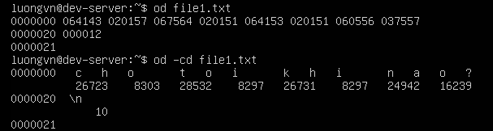
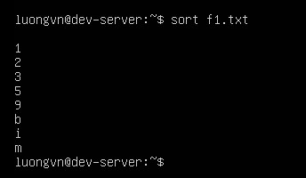
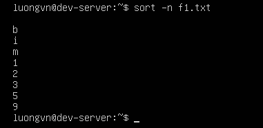
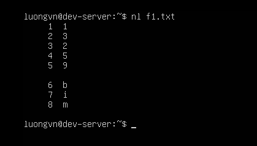

# PROCESSING TEXT USING FILTERS
## File-Combining Commands(Lệnh kết hợp tệp)

Trong Linux, nhiều lệnh dòng lệnh được thiết kế để xử lý và kết hợp các tệp văn bản. Một số công cụ phổ biến giúp nối, ghép hoặc trộn dữ liệu từ nhiều nguồn.

1) `cat` - hiển thị và ghép tệp:
- Dạng đơn giản nhất của lệnh xử lý văn bản.
- Dùng để hiển thị nộ dung tệp hoặc kết hợp nhiều tệp lại thành 1 tệp duy nhất.
```bash
cat file1 file2 > combined.txt
```
-> Kết hợp `file1` và `file2` thành `combined.txt`.
- Có thể dùng `cat -n` để đánh số dòng hoặc `cat -b` để chỉ đánh số dòng không trống.

2) `tac` - hiển thị ngược dòng
- Là phiên bản ngược của `cat`, hiển thị nội dung từ dưới lên trên:
```bash
tac file.txt
```

3) `paste` - ghép nội dung theo cột
- Dùng để kết hợp tệp theo chiều ngang (từng dòng của các tệp sẽ được nối song song).
```bash
paste file1 file2
```
-> Ghép hai tệp, ngăn cách bằng tab.

- Có thể đổi ký tự phân tách bằng `-d`, ví dụ:
```bash
paste -d "," file1 file2
```

## File-Transforming Commands(Lệnh chuyển đổi nội dung tệp)
1) `od`
- Sử dụng lệnh od để chuyển đổi file dạng text sang octal
- sử dụng thêm tùy chọn -cb sẽ hiển thị thông tin bổ sung



2) `hexdump` - Hiển thị dữ liệu nhị phân dưới dạng hexa.
3) `split` – Chia tệp lớn thành nhiều tệp nhỏ
- Cú pháp:
```bash
split [tùy chọn] <tệp_nguồn> [tên_cơ_sở]
```

- Ví dụ chia theo dòng:
```bash
split -l 3 /etc/passwd small_
```
→ Chia tệp /etc/passwd thành các tệp nhỏ, mỗi tệp chứa 3 dòng, đặt tên lần lượt small_aa, small_ab, small_ac, …

- Có thể chỉ định kích thước bằng byte, ví dụ:
```bash
split -b 1M largefile.bin part_
```

→ Mỗi tệp có dung lượng 1 MB.

## File-Formatting Commands
Sử dụng lệnh `sort` để sắp xếp đầu ra file theo thứ tự



Tùy chọn `-n` để sắp xếp theo thứ tự ngược lại



### Numbering with nl

Sử dụng lệnh `nl` để đánh số các dòng trong file



## File-Viewing Commands